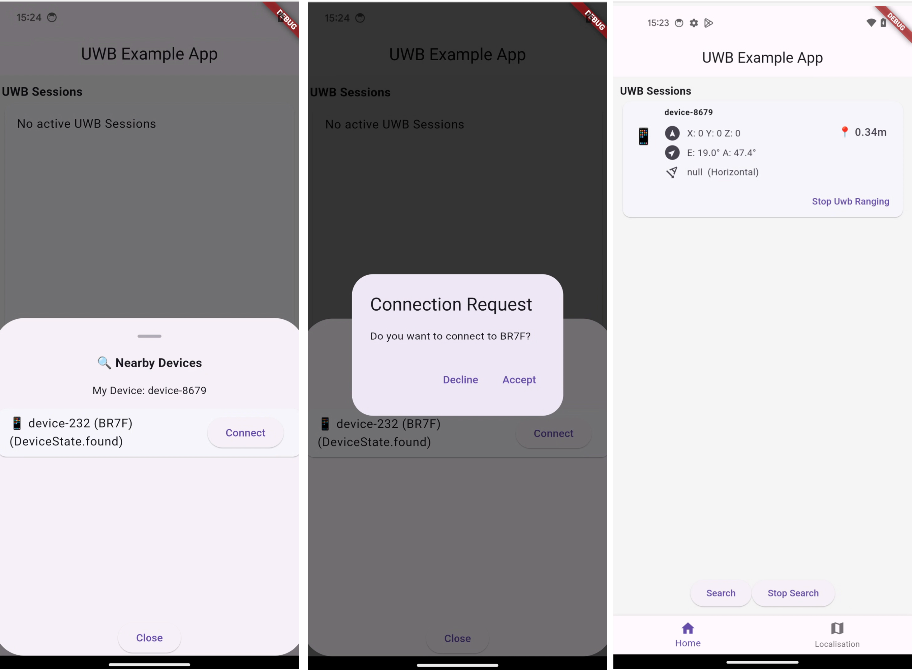

# Flutter Plugin for using UWB

This repository is part of my master's thesis titled **"Design and development
of a platform-independent UWB framework using Flutter"**  at HTWG Konstanz.

_Original title: "Entwurf und Entwicklung eines plattformunabhängigen
UWB-Frameworks unter Verwendung von Flutter"_

## Description

This Flutter plugin enables the use of native UWB frameworks: [Android
Core-Ultra Wideband](https://developer.android.com/jetpack/androidx/releases/core-uwb)
and [Apple Nearby
Interaction](https://developer.apple.com/documentation/nearbyinteraction/). It
also integrates out-of-band mechanisms such as [Google Nearby
Connections](https://developers.google.com/nearby/connections/overview) and
[Apple Multipeer
Connectivity](https://developer.apple.com/documentation/multipeerconnectivity)
to find nearby devices and exchange configuration parameters. The aim of the
prototype is to provide a simple starting point for using UWB technology with
smartphones. The basic functionalities of both frameworks are abstracted with a
standardized interface.

## Folder structure

- `/src/uwb`
    - Source code of the uwb flutter package
        - Dart Code: `/src/uwb/lib`
        - Apple SDK (Swift): `/src/uwb/ios`
        - Android SDK (Kotlin): `/src/uwb/android`
    - example app
    - License
- `/measurements`
    - experimentally measured data

## Features
- Advertise and discover nearby devices
- Receive UWB data such as distance and direction
- Listen to the different states of the out-of-band mechanism and the UWB session
- Connect to the Devkit [DWM3001CDK](https://www.qorvo.com/products/p/DWM3001CDK) with an iPhone

## Supported Hardware

- iPhone >=11 with iOS >=15
- Pixel 6 Pro, Pixel 7 Pro, Pixel 8 Pro

## How to use the package in your own Flutter App

### Required Software

- Flutter SDK: >=3.2.6 <4.0.0

### Add package to pubspec.yml

```yml
...
dependencies:
  uwb:
    path: path/to/repo
...
```


### Setting up permissions

The package requires permissions on each platform

#### Android

Add the following lines to the `AndroidManifest.xml` file of your app:
```xml
<!-- Required by Nearby Connections -->
<uses-permission android:name="android.permission.BLUETOOTH" android:maxSdkVersion="30" />
<uses-permission android:name="android.permission.BLUETOOTH_ADMIN" android:maxSdkVersion="30" />
<uses-permission android:name="android.permission.ACCESS_WIFI_STATE" />
<uses-permission android:name="android.permission.CHANGE_WIFI_STATE" />
<uses-permission android:name="android.permission.ACCESS_COARSE_LOCATION" android:maxSdkVersion="32" />
<uses-permission android:name="android.permission.ACCESS_FINE_LOCATION" android:maxSdkVersion="32" />
<uses-permission android:name="android.permission.BLUETOOTH_SCAN" android:usesPermissionFlags="neverForLocation" />
<uses-permission android:name="android.permission.BLUETOOTH_ADVERTISE" />
<uses-permission android:name="android.permission.BLUETOOTH_CONNECT" />
<uses-permission android:name="android.permission.NEARBY_WIFI_DEVICES"  android:usesPermissionFlags="neverForLocation" />
<uses-permission android:name="android.permission.FOREGROUND_SERVICE" />

<!-- Required by Android Core UWB  -->
<uses-permission android:name="android.permission.UWB_RANGING" />
<uses-feature android:name="android.hardware.uwb" android:required="true" />
```

#### iOS

Add the following lines to `ios/Runner/Info.plist`:

- Minimal iOS Version: 15

```xml
<!-- Required by Multipeer Connectivity -->
<key>NSBluetoothAlwaysUsageDescription</key>
<string>your usage description</string>
<key>NSBluetoothPeripheralUsageDescription</key>
<string>your usage description</string>
<key>NSBonjourServices</key>
<array>
    <string>_uwbexample._tcp</string>
    <string>_uwbexample._udp</string>
</array>
<!-- Required for the plugin to improve UWB localization (AR kit) -->
<key>NSCameraUsageDescription</key>
<string>your usage description</string>
<!-- Required by Nearby Interaction -->
<key>NSNearbyInteractionAllowOnceUsageDescription</key>
<string>your usage description</string>
<key>NSNearbyInteractionUsageDescription</key>
<string>your usage description</string>
```

### Using in a Flutter-App

1. **Initialize Plugin**

```dart
final Uwb uwbPlugin = Uwb();
```

2. **Check UWB Support**
```dart
var supported =  await uwbPlugin.isUwbSupported();
```

3. **Discover other devices and advertise your own device**
```dart
await uwbPlugin.discoverDevices(name: "Your Device Name");
````

4. **Listen to Discovery Service**
```dart
uwbPlugin.discoveryStateStream.listen((event) {
    switch (event) {
        case DeviceFoundState(device: var device):
        print('Device ${device.name} found');
        break;
        // ...
    }
});
```

5. **Display all discovered devices**
```dart
StreamBuilder<Iterable<UwbDevice>(
    stream: uwbPlugin.discoveredDevicesStream.stream,
    builder: (context, snapshot) {
        return ListView(
            children: snapshot.data!.map((device) {
                return ListItem(device: device);
            },
        ).toList());
    }
);
```

6. **Accept or decline an invitation request**
```dart
await uwbPlugin.handleConnectionRequest(device, accepted: true);
```

7. **Start a UWB-Session**
```dart
// Start the Session
await uwbPlugin.startRanging(device);

// Listen to the UWB Data stream
uwbPlugin.uwbDataStream.listen((devices) {
    devices.forEach((device) {
        print("Device: ${device.name} - Distance: ${device.distance}")
    });
});
```

8. **Listen to UWB-Events**
```dart
uwbPlugin.uwbSessionStateStream.listen((event) {
    switch (event) {
        case UwbSessionStartedState(device: var device):
        // ...
        break;
        case UwbSessionDisconnectedState(device: var device):
        // ...
        break;
    }
});
```

### All available methods

```dart
void discoverDevices(String deviceName);
void stopDiscovery();
void handleConnectionRequest(UwbDevice device, bool accept);
bool isUwbSupported();
void startRanging(UwbDevice device);
void stopRanging(UwbDevice device);
void stopUwbSessions();
```

### Example App

In the folder `/src/uwb/example` is a sample app that demonstrates the framework's functionalities on Android and iOS.

- Connect with an Android or iOS device 
- Connect with the devkit  [DWM3001CDK](https://www.qorvo.com/products/p/DWM3001CDK)
- Localization in a room using at least three devkits with at least three devkits

**Example User Interface**


## License notice

### Qorvo

This software uses parts from the [Qorvo DWM3001CDK Development
Kit](https://www.qorvo.com/products/p/DWM3001CDK) to prototype the usage of
localization and ranging with the DWM3001CDK and Apple Nearby Interaction. This
was used for academic purposes. For the full license, see `/src/uwb/LICENSE.md`

### Flutter UWB Plugin

The rest of the software is under MIT license:

Copyright 2024 Christian Greiner

Permission is hereby granted, free of charge, to any person obtaining a copy of this software and associated documentation files (the “Software”), to deal in the Software without restriction, including without limitation the rights to use, copy, modify, merge, publish, distribute, sublicense, and/or sell copies of the Software, and to permit persons to whom the Software is furnished to do so, subject to the following conditions:

The above copyright notice and this permission notice shall be included in all copies or substantial portions of the Software.

THE SOFTWARE IS PROVIDED “AS IS”, WITHOUT WARRANTY OF ANY KIND, EXPRESS OR IMPLIED, INCLUDING BUT NOT LIMITED TO THE WARRANTIES OF MERCHANTABILITY, FITNESS FOR A PARTICULAR PURPOSE AND NONINFRINGEMENT. IN NO EVENT SHALL THE AUTHORS OR COPYRIGHT HOLDERS BE LIABLE FOR ANY CLAIM, DAMAGES OR OTHER LIABILITY, WHETHER IN AN ACTION OF CONTRACT, TORT OR OTHERWISE, ARISING FROM, OUT OF OR IN CONNECTION WITH THE SOFTWARE OR THE USE OR OTHER DEALINGS IN THE SOFTWARE.
